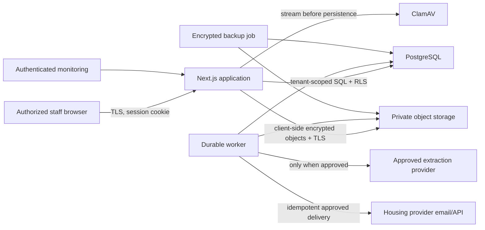

# Privacy and data-flow engineering review

Reviewed July 14, 2026. Status: engineering controls implemented; organization-specific legal/privacy approval remains required before real applicant data.

## Purpose and data inventory

The application helps authorized housing staff collect applicant/household details, upload evidence, review machine-proposed values, map reviewed values into application templates, capture consent/signature attestations, generate packets, and deliver an approved application. It can contain identifiers, contact details, dates of birth, household relationships, housing history, accessibility/disability information, veteran and benefit status, income, source documents, signatures, consent records, staff identities, and delivery records. These categories may be sensitive even where a particular law does not classify all of them identically.

The system must not be used to make autonomous eligibility, priority, fraud, or adverse decisions. Extraction output is a proposal with source evidence and human review state.

## Data flow

Browser-to-app transport terminates at the operator's TLS proxy. PostgreSQL separates the RLS-limited application role from a narrow pre-authentication/system role. Every authenticated request establishes one organization context. Stored uploads, exports, job payloads, destination credentials, MFA secrets, and backups use authenticated encryption; production configuration requires an external 32-byte key. Backups and database migrations use a separate owner credential.

## Minimization and disclosure controls

- Audit metadata excludes applicant values, document contents, credentials, and signatures.
- Rate-limit identifiers and source IPs are hashed.
- Provider calls send a document only when the organization explicitly configures and approves that processor.
- External AI is disabled by default; production rejects an unapproved provider ID.
- OpenRouter requests enforce ZDR routing, but downstream-provider approval is still mandatory.
- Exports are encrypted at rest, checksum-verified on download, administrator-only, and recorded in the audit chain.
- Provider delivery requires reviewer approval, selected/authorized documents, stable idempotency, and durable retry.

## Retention, access, deletion, and correction

Each organization configures retention and deletion-grace days. Cases receive an expiry date; the worker schedules expired cases, legal holds prevent or cancel deletion, and staff may correct data through existing reviewed workflows. Manual deletion requires a reason and a different administrator's approval. Managed document objects and relational case data are deleted; the lifecycle request and append-only audit retain opaque identifiers and action evidence. Administrator exports contain the case graph, evidence bytes, and audit history in an encrypted gzip package.

## Privacy decisions still owned by a deploying organization

The deploying organization must identify controller/processor roles, lawful bases, notices and consent language, applicable housing-record and public-record schedules, legal-hold authority, data-subject/request verification, minors' data rules, accessibility/disability-data handling, international transfers, approved delivery destinations, and incident notification duties. Counsel/privacy staff must approve those decisions and the selected infrastructure/vendor contracts. This repository cannot make those jurisdiction- and agency-specific decisions.
